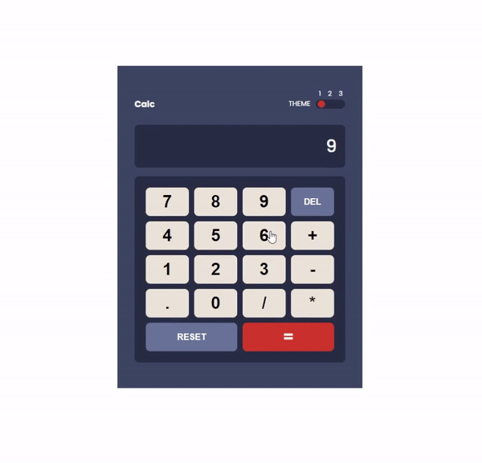

  

#📌 Features

- The app takes two operands and one operator to do calculation.
- There are three themes and each theme can be switched on with the toggle button on the top right corner.

#💭 Why This Project?

**1. To Learn Typescript**
I have been learning Typescript syntax. This project was for getting my foot in the door of Typescript and digest the input knowledge by doing a toy project.

**2. To Implement three states toggle button**
I want to know how to build toggle buttons and understand how they work under the hood.

#🔨 Future Improvement
Improve the logics for the `displayCalculation` function.

#💻 Technologies
Typescript
HTML
CSS

#🚀Start the app

1. Download and install Git
2. Follow the following command lines.
   > git clone https://github.com/chepark/typescript-calc.git
   > npm install
   > npm start
